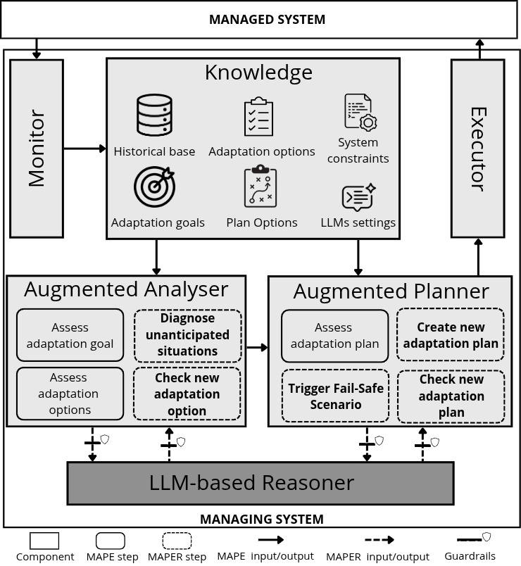
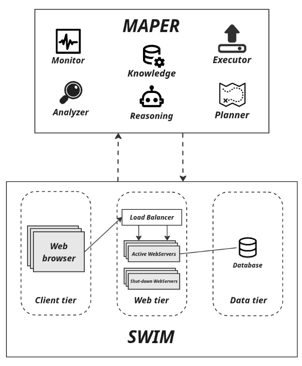

# MAPER: MAPE-K Extended with LLM Reasoning

## Overview

MAPER is an extension of the classical **MAPE-K architecture** (Monitor, Analyze, Plan, Execute, and Knowledge) designed for **self-adaptive systems** operating under uncertainty.

The core innovation of MAPER is the integration of an **LLM-based Reasoner**. This component augments the traditional control loop by enabling the system to handle **unanticipated situations**, incomplete knowledge, and runtime conditions that were not foreseen at design time.

The LLM Reasoner acts as an experienced human consultant inside the loop. It helps the system:
- Diagnose unforeseen or ambiguous conditions
- Propose new adaptation options beyond predefined rules
- Construct adaptation plans dynamically
- Check the feasibility and coherence of its own suggestions before execution

By combining the structured rigor of MAPE-K with the contextual and inferential power of Large Language Models, MAPER significantly increases software **resilience**, **autonomy**, and **adaptation quality**. Experimental results show that MAPER improves adaptation outcomes under high uncertainty, reducing policy violations while maintaining system goals more effectively.

---

## Architecture

Below is a high-level view of the MAPER architecture, highlighting the integration of the LLM Reasoner into the classical MAPE-K loop.



---

## How to Run the Project

### 1. Prerequisites

- Docker
- Docker Compose
- An OpenAI-compatible API key

---

### 2. Environment Configuration

Create a `.env` file at the root of the project with the following content: 

> `OPENAI_API_KEY=your_api_key_here`

This key is required for the LLM Reasoner to operate.

---

### 3. Build and Run

From the project root, execute:
```bash
docker-compose up --build
```

Once this command is executed, the entire MAPER process will start automatically, including the self-adaptive control loop and the LLM-based reasoning component.

---

## Customization and Configuration

MAPER is designed to be highly configurable and extensible.

### Prompt Engineering and Business Rules

All configuration related to the knowledge base (constraints, goals, adaptation options, plans, and LLM settings) is defined in:

> `src/user_config.py`

This file controls how MAPER interprets the environment and performs self-adaptation.

The user_config.py file is organized into the following conceptual sections:

- Constraints: define what is allowed or forbidden
- Adaptation Goals: define what the system tries to achieve
- Adaptation Options: define how system states are diagnosed
- Plan Options: define what actions are executed in response to states
- LLM Settings: define how the reasoning component behaves

Each section contributes to a different phase of the MAPER control loop.

For a complete and detailed explanation of all configuration options, examples, and advanced usage, see:

[CONFIG_DOCUMENTATION](docs/config-README.md)

---

### Environment Configuration (SWIM)

- SWIM is a simulation environment built on top of OMNeT++ 
- Used to model and evaluate self-adaptive software systems under controlled and reproducible conditions 
- It represents a service-oriented application with variable workload, server pools, and quality-of-service mechanisms such as brownout and dynamic scaling
- Within MAPER, SWIM acts as the managed environment where adaptation decisions are applied 
- Allows researchers to observe how the control loop responds to changing demand, failures, and uncertainty over time

Below is a high-level view of the SWIM architecture, highlighting the integration with our approach.



The simulated environment is configured via the `swim.ini` file, which defines how the SWIM network is executed inside OMNeT++.

This file controls simulation duration, workload input, server pool limits, and key parameters that influence adaptation behavior.

Only the most relevant parameters for adaptation and experimentation are described here. OMNeT++-specific and auxiliary settings are intentionally omitted.

For a complete and detailed explanation of the environment configuration and its key variables, see:

[ENVIRONMENT_DOCUMENTATION](docs/environment-README.md)

### Request Scenario Generation

We also bring the support to creation of custom request-load scenarios to simulate realistic and adversarial workloads.

These scenarios are generated using a dedicated Jupyter Notebook that allows users to explicitly design how requests arrive over time, including peaks, bursts, and normalization phases.

The notebook produces a deterministic request trace that is later consumed by the simulator during execution.

For a complete explanation of request scenario generation, workload patterns, and examples, see:

[SCENARIO_DOCUMENTATION](docs/scenario-README.md)


### Crash and Failure Injection

MAPER supports the injection of crashes, faults, and unexpected runtime disruptions to evaluate system resilience and adaptation behavior.

All failure and crash scenarios are defined in:

> `src/unexpected_simulator/scenario.py`

These scenarios specify when unexpected events occur and which actions are executed to disturb the system during execution.

For a complete explanation of scenario configuration, failure modeling patterns, and advanced examples, see:

[UNEXPECTED_SIMULATOR_DOCUMENTATION](docs/crash-README.md)

---

## Demo Video

A demonstration video explaining how to run the application:

[MAPER Demo Video](docs/guide.mp4)

And a video containing a complete execution:

[](https://www.youtube.com/watch?v=iS7G-Fh3-5g)

---

## Summary

MAPER extends MAPE-K with LLM-based reasoning to bridge the gap between design-time assumptions and runtime uncertainty. It empowers self-adaptive systems to reason, adapt, and evolve in complex and unpredictable environments—without relying solely on pre-programmed knowledge.

Welcome to adaptive software that can truly think on its feet.

